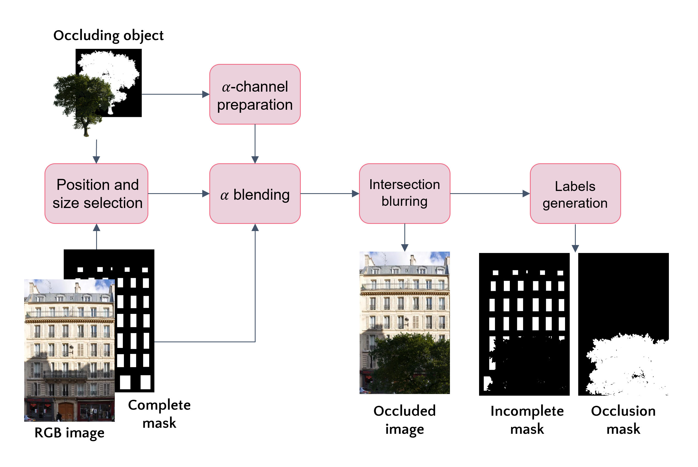

# occ-data-generation

To overcome the lack of fully annotated fac¸ade occlusion dataset, we develop a workflow to generate a simulated dataset by overlaying synthetic occlusions onto existing fac¸ade benchmarks which originally lacks such occlusions. The objective is to render images that realistically simulate occlusions of various types and sizes. These simulated images can be used to train models that effectively handle real-world occlusions in downstream applications. To create this comprehensive occluded dataset, we deploy the existing benchmarks that are commonly used in fac¸ade parsing tasks: ECP, CMP, Graz-50 and our in-house annotated KIT dataset. Thus, the newly established dataset, named facade-occ, consists of 1090 images.

Our dataset generation process begins with defining common fac¸ade obstructions, followed by realistically incorporating synthetic occlusions into the existing benchmark.

To occlude a dataset:

1. Specify important paths:

	oc_img_path= path of the occluders RGB images
	oc_mask_path= path of the occluders binary mask
	base_in_dir = path of dataset to occlude
	base_out_dir = path to locate the new occluded dataset

2. run create-simulated-dataset.py with parameter -m and -r:

-m: split dataset to occlude, eg. train, val, test
-r: occlusion ratio, % of samples in the dataset to occlude

eg. python create-simulated-dataset.py -m train -r 0.6
